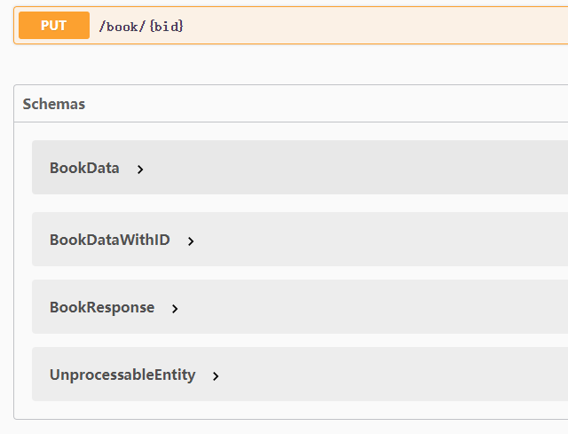

If you want to validate response and generate **Schemas**, pass the **`responses`**.

```python hl_lines="13"
class BookBodyWithID(BaseModel):
    bid: int = Field(..., description='book id')
    age: Optional[int] = Field(None, ge=2, le=4, description='Age')
    author: str = Field(None, min_length=2, max_length=4, description='Author')


class BookResponse(BaseModel):
    code: int = Field(0, description="status code")
    message: str = Field("ok", description="exception information")
    data: BookBodyWithID


@app.get('/book/<int:bid>', tags=[book_tag], responses={"200": BookResponse}, security=security)
def get_book(path: BookPath, query: BookBody):
    """get book
    get book by id, age or author
    """
    return {"code": 0, "message": "ok", "data": {"bid": path.bid, "age": query.age, "author": query.author}}
```

*New in v0.9.5*

By default, the `VALIDATE_RESPONSE` environment variable is `False`. You can set it `True` to validate responses in the
development environment.

!!! warning

    Please do not use it in the production environment, because it will reduce the performance.



### OpenAPI responses

*New in v0.9.4*

You can add `responses` for each API under the `app` wrapper.

```python hl_lines="4"
app = OpenAPI(
    __name__, 
    info=info, 
    responses={"404": NotFoundResponse}
)

@app.get(...)
def endpoint():
    ...
```

### abp_responses

*New in v0.9.4*

You can add `responses` for each API under the `api` wrapper.

```python hl_lines="10"
class Unauthorized(BaseModel):
    code: int = Field(-1, description="Status Code")
    message: str = Field("Unauthorized!", description="Exception Information")


api = APIBlueprint(
    '/book', 
    __name__, 
    url_prefix='/api',
    abp_responses={"401": Unauthorized}
)

@api.get(...)
def endpoint():
    ...
```

### extra_responses

*New in v1.0.0*

You can pass to your path operation decorators a parameter `extra_responses`.

It receives a `dict`, the keys are status codes for each response, like `200`, and the values are other dicts with the
information for each of them.

Like this:

```python
@app.get(
    '/book/<int:bid>',
    tags=[book_tag],
    responses={"200": BookResponse},
    extra_responses={"200": {"content": {"text/csv": {"schema": {"type": "string"}}}}},
    security=security
)
def get_book(path: BookPath):
    ...


@api.post('/book', extra_responses={"200": {"content": {"text/csv": {"schema": {"type": "string"}}}}})
def create_book(body: BookBody):
    ...
```

## More information about OpenAPI responses

- [OpenAPI Responses Object](https://spec.openapis.org/oas/v3.0.3#responses-object), it includes the Response Object.
- [OpenAPI Response Object](https://spec.openapis.org/oas/v3.0.3#response-object).