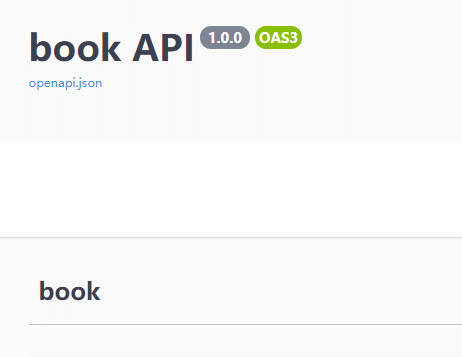

You can also specify tag for apis, like this:

```python hl_lines="3 6"
...

book_tag = Tag(name='book', description='Some Book')


@api.get('/book', tags=[book_tag])
def get_book():


...
```

and then you will get the magic.



### abp_tags

*New in v0.9.3*

You don't need to specify **tag** for every api.

```python hl_lines="3"
tag = Tag(name='book', description="Some Book")

api = APIBlueprint('/book', __name__, url_prefix='/api', abp_tags=[tag])


@api.post('/book')
def create_book(body: BookBody):
    ...
```
