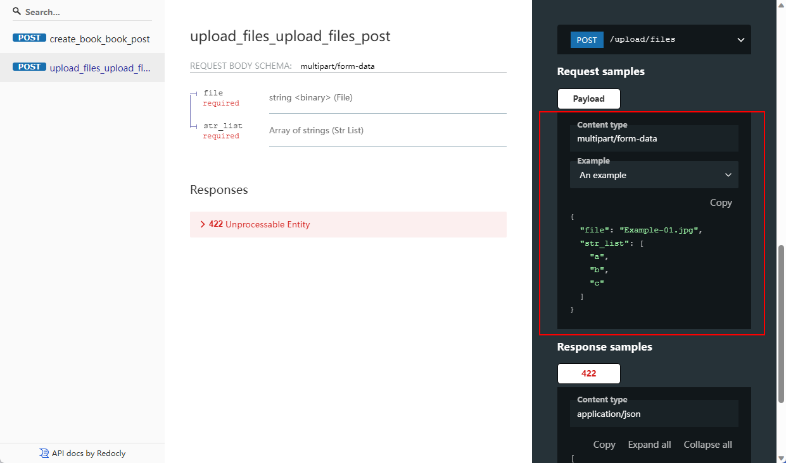

The [BaseModel](https://docs.pydantic.dev/latest/usage/models/) in [Pydantic](https://github.com/pydantic/pydantic) 
supports some custom configurations([Model Config](https://docs.pydantic.dev/latest/usage/model_config/)), 
so we can use the `openapi_extra` to extend OpenAPI Specification.

## openapi_extra

*New in v2.4.0*


The `openapi_extra` will be merged with the automatically generated OpenAPI schema.

### form

```python
class UploadFilesForm(BaseModel):
    file: FileStorage
    str_list: List[str]

    class Config:
        openapi_extra = {
            # "example": {"a": 123},
            "examples": {
                "Example 01": {
                    "summary": "An example",
                    "value": {
                        "file": "Example-01.jpg",
                        "str_list": ["a", "b", "c"]
                    }
                },
                "Example 02": {
                    "summary": "Another example",
                    "value": {
                        "str_list": ["1", "2", "3"]
                    }
                }
            }
        }
```

Effect in Redoc:



### body

```python
class BookBody(BaseModel):
    age: int
    author: str

    class Config:
        openapi_extra = {
            "description": "This is post RequestBody",
            "example": {"age": 12, "author": "author1"},
            "examples": {
                "example1": {
                    "summary": "example summary1",
                    "description": "example description1",
                    "value": {
                        "age": 24,
                        "author": "author2"
                    }
                },
                "example2": {
                    "summary": "example summary2",
                    "description": "example description2",
                    "value": {
                        "age": 48,
                        "author": "author3"
                    }
                }

            }}
```

Effect in swagger:


### responses

```python
class MessageResponse(BaseModel):
    message: str = Field(..., description="The message")

    class Config:
        openapi_extra = {
            # "example": {"message": "aaa"},
            "examples": {
                "example1": {
                    "summary": "example1 summary",
                    "value": {
                        "message": "bbb"
                    }
                },
                "example2": {
                    "summary": "example2 summary",
                    "value": {
                        "message": "ccc"
                    }
                }
            }
        }
```

Effect in swagger:


## by_alias

*New in v2.5.0*

Sometimes you may not want to use aliases (such as in the responses model). In that case, `by_alias` will be convenient:

```python
class MessageResponse(BaseModel):
    message: str = Field(..., description="The message")
    metadata: Dict[str, str] = Field(alias="metadata_")

    class Config:
        by_alias = False
```