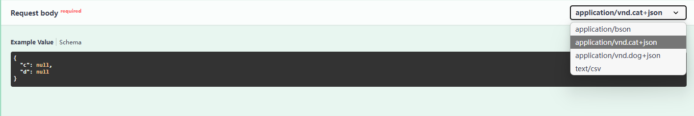

## Request declaration

First, you need to import `BaseModel` from `pydantic`:

```python
from pydantic import BaseModel
```

### path

Request parameter in rules，**`@app.get('/book/<int:bid>')`**.

You have to declare **path** model as a class that inherits from  **`BaseModel`**:

```python hl_lines="6"
class BookPath(BaseModel):
    bid: int = Field(..., description='book id')


@app.get('/book/<int:bid>', tags=[book_tag], security=security)
def get_book(path: BookPath):
    ...
```

### query

Receive flask **`request.args`**.

!!! info

    ```python
    from flask import request
    ```

like [path](#path), you need pass **`query`** to view function.

```python hl_lines="7"
class BookQuery(BaseModel):
    age: int | None = Field(..., ge=2, le=4, description='Age')
    author: str = Field(None, min_length=2, max_length=4, description='Author')


@app.get('/book/<int:bid>', tags=[book_tag], security=security)
def get_book(path: BookPath, query: BookQuery):
    ...
```

### form

Receive flask **`request.form`** and **`request.files`**.

```python hl_lines="7"
class UploadFileForm(BaseModel):
    file: FileStorage  # request.files["file"]
    file_type: str = Field(None, description="File type")


@app.post('/upload')
def upload_file(form: UploadFileForm):
    ...
```

### body

Receive flask **`request.json`**.

```python hl_lines="7"
class BookBody(BaseModel):
    age: int | None = Field(..., ge=2, le=4, description='Age')
    author: str = Field(None, min_length=2, max_length=4, description='Author')


@app.post('/book', tags=[book_tag])
def create_book(body: BookBody):
    ...
```

### header

Receive flask **`request.headers`**.

### cookie

Receive flask **`request.cookies`**.

### raw

Receive flask **`request`** and no data validation.

```python
from flask_openapi3 import RawModel


class BookRaw(RawModel):
    mimetypes = ["text/csv", "application/json"]


@app.post("/book")
def get_book(raw: BookRaw):
    # raw equals to flask.request
    print(raw.data)
    print(raw.mimetype)
    return "ok"
```

## @validate_request

Sometimes you want to delay the verification request parameters, such as after login verification:

```python
from flask_openapi3 import validate_request


def login_required():
    def decorator(func):
        @wraps(func)
        def wrapper(*args, **kwargs):
            if not request.headers.get("Authorization"):
                return {"error": "Unauthorized"}, 401
            return func(*args, **kwargs)

        return wrapper

    return decorator


@app.get("/book")
@login_required
@validate_request()
def get_book(query: BookQuery):
    ...
```

### Custom kwargs are maintained

When your 'auth decorator' injects custom kwargs, these will be passed on to the final function for you to use.

Any kwargs which are part of the 'path' will have been consumed at this point and can only be referenced using the `path`.

So avoid using kwarg-names which overlap with the path.

```python
from flask_openapi3 import validate_request
from functools import wraps


def login_required():
    def decorator(func):
        @wraps(func)
        def wrapper(*args, **kwargs):
            if not request.headers.get("Authorization"):
                return {"error": "Unauthorized"}, 401
            kwargs["client_id"] = "client1234565"
            return func(*args, **kwargs)

        return wrapper

    return decorator


@app.get("/book")
@login_required()
@validate_request()
def get_book(query: BookQuery, client_id:str = None):
    print(f"Current user identified as {client_id}")
    ...
```

## Multiple content types in the request body

```python
from typing import Union

from flask import Request
from pydantic import BaseModel

from flask_openapi3 import OpenAPI

app = OpenAPI(__name__)


class DogBody(BaseModel):
    a: int = None
    b: str = None

    model_config = {
        "openapi_extra": {
            "content_type": "application/vnd.dog+json"
        }
    }


class CatBody(BaseModel):
    c: int = None
    d: str = None

    model_config = {
        "openapi_extra": {
            "content_type": "application/vnd.cat+json"
        }
    }


class BsonModel(BaseModel):
    e: int = None
    f: str = None

    model_config = {
        "openapi_extra": {
            "content_type": "application/bson"
        }
    }


class ContentTypeModel(BaseModel):
    model_config = {
        "openapi_extra": {
            "content_type": "text/csv"
        }
    }


@app.post("/a", responses={200: DogBody | CatBody | ContentTypeModel | BsonModel})
def index_a(body: DogBody | CatBody | ContentTypeModel | BsonModel):
    """
    multiple content types examples.

    This may be confusing, if the content-type is application/json, the type of body will be auto parsed to
    DogBody or CatBody, otherwise it cannot be parsed to ContentTypeModel or BsonModel.
    The body is equivalent to the request variable in Flask, and you can use body.data, body.text, etc ...
    """
    print(body)
    if isinstance(body, Request):
        if body.mimetype == "text/csv":
            # processing csv data
            ...
        elif body.mimetype == "application/bson":
            # processing bson data
            ...
    else:
        # DogBody or CatBody
        ...
    return {"hello": "world"}
```

The effect in swagger:




## Request model

First, you need to define a [pydantic](https://github.com/pydantic/pydantic) model:

```python
class BookQuery(BaseModel):
    age: int = Field(..., ge=2, le=4, description='Age')
    author: str = Field(None, description='Author')
```

More information to see [BaseModel](https://docs.pydantic.dev/latest/usage/models/), and you
can [Customize the Field](https://docs.pydantic.dev/latest/usage/fields/).

However, you can also use **Field** to extend [Parameter Object](https://spec.openapis.org/oas/v3.1.0#parameter-object).
Here is an example:

`age` with **`example`** and `author` with **`deprecated`**.

```python
class BookQuery(BaseModel):
    age: int = Field(..., ge=2, le=4, description='Age', json_schema_extra={"example": 3})
    author: str = Field(None, description='Author', json_schema_extra={"deprecated": True})
```

The effect in swagger:


More available fields to see [Parameter Object Fixed Fields](https://spec.openapis.org/oas/v3.1.0#fixed-fields-9).
