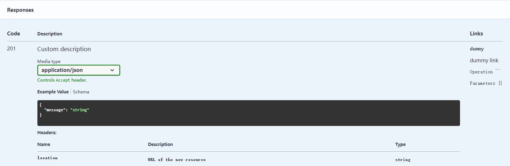
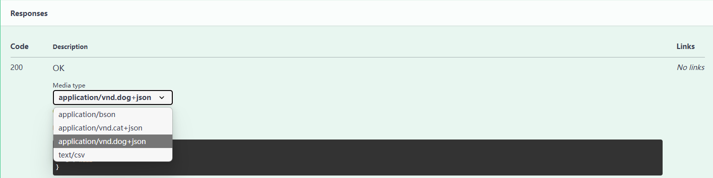

## responses

If you want to generate **Schemas**, pass the **`responses`**.

```python hl_lines="13"
class BookBodyWithID(BaseModel):
    bid: int = Field(..., description='book id')
    age: int | None = Field(None, ge=2, le=4, description='Age')
    author: str = Field(None, min_length=2, max_length=4, description='Author')


class BookResponse(BaseModel):
    code: int = Field(0, description="status code")
    message: str = Field("ok", description="exception information")
    data: BookBodyWithID


@app.get('/book/<int:bid>', 
         tags=[book_tag], 
         responses={
             200: BookResponse, 
             # Version 2.4.0 starts supporting response for dictionary types
             201: {"content": {"text/csv": {"schema": {"type": "string"}}}}
         })
def get_book(path: BookPath, query: BookBody):
    """get a book
    get book by id, age or author
    """
    return {"code": 0, "message": "ok", "data": {}}
```

Now you can use `string`, `int`, and `HTTPStatus` as response's key.

```python hl_lines="5 7"
from http import HTTPStatus


class BookResponse(BaseModel):
    message: str = Field(..., description="The message")

    
@api.get("/hello/<string:name>",
        responses={
            HTTPStatus.OK: BookResponse, 
            "201": {"content": {"text/csv": {"schema": {"type": "string"}}}},
            204: None
        })
def hello(path: HelloPath):
    message = {"message": f"""Hello {path.name}!"""}

    response = make_response(json.dumps(message), HTTPStatus.OK)
    response.mimetype = "application/json"
    return response
```


*Sometimes you may need more description fields about the response, such as description, headers and links.

You can use the following form:

```python
@app.get(
     "/test",
     responses={
         "201": {
             "model": BaseResponse,
             "description": "Custom description",
             "headers": {
                 "location": {
                     "description": "URL of the new resource",
                     "schema": {"type": "string"}
                 }
             },
             "links": {
                 "dummy": {
                     "description": "dummy link"
                 }
             }
         }
     }
 )
 def endpoint_test():
     ...
```

The effect in swagger:




## Multiple content types in the responses

```python
from typing import Union

from flask import Request
from pydantic import BaseModel

from flask_openapi3 import OpenAPI

app = OpenAPI(__name__)


class DogBody(BaseModel):
    a: int = None
    b: str = None

    model_config = {
        "openapi_extra": {
            "content_type": "application/vnd.dog+json"
        }
    }


class CatBody(BaseModel):
    c: int = None
    d: str = None

    model_config = {
        "openapi_extra": {
            "content_type": "application/vnd.cat+json"
        }
    }


class BsonModel(BaseModel):
    e: int = None
    f: str = None

    model_config = {
        "openapi_extra": {
            "content_type": "application/bson"
        }
    }


class ContentTypeModel(BaseModel):
    model_config = {
        "openapi_extra": {
            "content_type": "text/csv"
        }
    }


@app.post("/a", responses={200: DogBody | CatBody | ContentTypeModel | BsonModel})
def index_a(body: DogBody | CatBody | ContentTypeModel | BsonModel):
    """
    multiple content types examples.

    This may be confusing, if the content-type is application/json, the type of body will be auto parsed to
    DogBody or CatBody, otherwise it cannot be parsed to ContentTypeModel or BsonModel.
    The body is equivalent to the request variable in Flask, and you can use body.data, body.text, etc ...
    """
    print(body)
    if isinstance(body, Request):
        if body.mimetype == "text/csv":
            # processing csv data
            ...
        elif body.mimetype == "application/bson":
            # processing bson data
            ...
    else:
        # DogBody or CatBody
        ...
    return {"hello": "world"}
```

The effect in swagger:




## Validate responses

By default, responses are not validated. If you need to validate responses, set validate_responses to True. Here are
several ways to achieve this:

```python
# 1. APP level
app = OpenAPI(__name__, validate_response=True)

# 2. APIBlueprint level
api = APIBlueprint(__name__, validate_response=True)

# 3. APIView level
@api_view.route("/test")
class TestAPI:
    @api_view.doc(responses={201: Response}, validate_response=True)
    def post(self):
        ...
        
# 4. api level
@app.post("/test", responses={201: Response}, validate_response=True)
def endpoint_test(body: BaseRequest):
    ...
```

You can also customize the default behavior of response validation by using a custom `validate_response_callback`.

```python

def validate_response_callback(response: Any, responses: Optional[ResponseDict] = None) -> Any:
    
    # do something
    
    return response

app = OpenAPI(__name__, validate_response=True, validate_response_callback=validate_response_callback)
```

## More information about OpenAPI responses

- [OpenAPI Responses Object](https://spec.openapis.org/oas/v3.1.0#responses-object), it includes the Response Object.
- [OpenAPI Response Object](https://spec.openapis.org/oas/v3.1.0#response-object).

