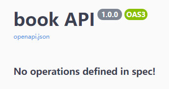

## Specification

If you need the complete Specification, go to http://127.0.0.1:5000/openapi/openapi.json

## command: flask openapi

The `flask openapi` command will export the OpenAPI Specification to console when you execute the command.

```
flask --app IMPORT openapi
```
where `IMPORT` is the Flask application, in our case an OpenAPI application, to loan.
For example, if your OpenAPI application is `app` defined in `hello.py`, 
as in the example in [Quickstart](../Quickstart.md#rest-api), the command is
`flask --app hello:app openapi `.
(For more information about the command line interface of Flask, please check out 
the [Flask CLI documentation](https://flask.palletsprojects.com/en/latest/cli/#application-discovery).)


Execute `flask --app IMPORT openapi --help` for more information about the command:

Again, assuming your OpenAPI application is `app` defined in `hello.py`,

```
flask --app hello:app openapi --help

Usage: flask openapi [OPTIONS]

  Export the OpenAPI Specification to console or a file

Options:
  -o, --output PATH               The output file path.
  -f, --format [json|yaml|markdown]
                                  The output file format.
  -i, --indent INTEGER            The indentation for JSON dumps.
  -a, --ensure_ascii              Ensure ASCII characters or not. Defaults to
                                  False.
  --help                          Show this message and exit.

```

Please note, by default, the command will export the OpenAPI specification in JSON.
If you want the OpenAPI specification in YAML, by running the command with the `-f yaml` option,
you need to install the `pyyaml` package.
```bash
pip install flask-openapi3[yaml]

# or
pip install pyyaml
```

## info

**`flask-openapi3`** provide [Swagger UI](https://github.com/swagger-api/swagger-ui), [Redoc](https://github.com/Redocly/redoc) and [RapiDoc](https://github.com/rapi-doc/RapiDoc) interactive documentation.
Before that, you should know something about the [OpenAPI Specification](https://spec.openapis.org/oas/v3.1.0).

You must import **`Info`** from **`flask-openapi3`**, it needs some parameters: **`title`**, **`version`**... , more information sees the [OpenAPI Specification Info Object](https://spec.openapis.org/oas/v3.1.0#info-object).

```python hl_lines="4 5"
from flask_openapi3 import Info
from flask_openapi3 import OpenAPI, APIBlueprint

info = Info(title='book API', version='1.0.0')
app = OpenAPI(__name__, info=info)
api = APIBlueprint('/book', __name__, url_prefix='/api')

if __name__ == '__main__':
    app.run()
```

run it, and go to http://127.0.0.1:5000/openapi, you will see the documentation.




## security_schemes

There are some examples for Security Scheme Object,
more features see the [OpenAPI Specification Security Scheme Object](https://spec.openapis.org/oas/v3.1.0#security-scheme-object).

```python
# Basic Authentication Sample
basic = {
  "type": "http",
  "scheme": "basic"
}
# JWT Bearer Sample
jwt = {
  "type": "http",
  "scheme": "bearer",
  "bearerFormat": "JWT"
}
# API Key Sample
api_key = {
  "type": "apiKey",
  "name": "api_key",
  "in": "header"
}
# Implicit OAuth2 Sample
oauth2 = {
  "type": "oauth2",
  "flows": {
    "implicit": {
      "authorizationUrl": "https://example.com/api/oauth/dialog",
      "scopes": {
        "write:pets": "modify pets in your account",
        "read:pets": "read your pets"
      }
    }
  }
}
security_schemes = {"jwt": jwt, "api_key": api_key, "oauth2": oauth2, "basic": basic}
```

First, you need to define the **security_schemes** and **security** variable:

```python
jwt = {
    "type": "http",
    "scheme": "bearer",
    "bearerFormat": "JWT"
}
security_schemes = {"jwt": jwt}

security = [{"jwt": []}]

app = OpenAPI(__name__, info=info, security_schemes=security_schemes)
```

Second, add pass the [**security**](./Route_Operation.md#security) to your api, like this:

```python hl_lines="1"
@app.get('/book/<int:bid>', tags=[book_tag], security=security)
def get_book(path: Path, query: BookBody):
    ...
```

result:


## oauth_config

You can pass `oauth_config` when initializing `OpenAPI`:

```python
from flask_openapi3 import OpenAPI, OAuthConfig
from flask_openapi3 import Info

info = Info(title='oauth API', version='1.0.0')

oauth_config = OAuthConfig(
    clientId="xxx",
    clientSecret="xxx"
)

oauth2 = {
  "type": "oauth2",
  "flows": {
    "implicit": {
      "authorizationUrl": "https://example.com/api/oauth/dialog",
      "scopes": {
        "write:pets": "modify pets in your account",
        "read:pets": "read your pets"
      }
    }
  }
}

security_schemes = {"oauth2": oauth2}

app = OpenAPI(__name__, info=info, oauth_config=oauth_config, security_schemes=security_schemes)

security = [
    {"oauth2": ["write:pets", "read:pets"]}
]


@app.get("/", security=security)
def oauth():
    return "oauth"


if __name__ == '__main__':
    app.run(debug=True)
```

Here's more information about [OAuth 2.0 configuration](https://github.com/swagger-api/swagger-ui/blob/master/docs/usage/oauth2.md)

## responses

You can add `responses` for each API under the `app` wrapper.

```python hl_lines="4"
app = OpenAPI(
    __name__, 
    info=info, 
    responses={404: NotFoundResponse}
)

@app.get(...)
def endpoint():
    ...
```

## abp_responses & view_responses

You can add `responses` for each API under the `api` or `api_view` wrapper.

```python hl_lines="10"
class Unauthorized(BaseModel):
    code: int = Field(-1, description="Status Code")
    message: str = Field("Unauthorized!", description="Exception Information")


api = APIBlueprint(
    "/book", 
    __name__, 
    url_prefix="/api",
    abp_responses={401: Unauthorized}
)

api_view = APIView(
    "/book",
    view_responses={401: Unauthorized}
)

@api.get(...)
def endpoint():
    ...
```

## doc_ui

You can pass `doc_ui=False` to disable the `OpenAPI spec` when init [`OpenAPI`](../Reference/OpenAPI.md).

```python
app = OpenAPI(__name__, info=info, doc_ui=False)
```

You can also use `doc_ui` in endpoint or when initializing [`APIBlueprint`](../Reference/APIBlueprint.md) or [`APIView`](../Reference/APIView.md).

```python hl_lines="4 9"
api = APIBlueprint(
    '/book',
    __name__,
    doc_ui=False
)

# or

@api.get('/book', doc_ui=False)
def get_book():
    ...
```

## doc_expansion

Just for Swagger UI.

String=["list", "full", "none"].

Controls the default expansion setting for the operations and tags. It can be 'list' (expands only the tags), full' (expands the tags and operations) or 'none' (expands nothing).

More information to see [Configuration](https://github.com/swagger-api/swagger-ui/blob/master/docs/usage/configuration.md).

```python
app = OpenAPI(__name__, info=info, doc_expansion='full')
```

## Interactive documentation

**Flask OpenAPI3** provides support for the following Interactive documentation:

- [Swagger](https://github.com/swagger-api/swagger-ui)
- [Redoc](https://github.com/Redocly/redoc)
- [RapiDoc](https://github.com/rapi-doc/RapiDoc)

The following are the default values of these configurations. Of course, you can change them:

- doc_prefix = "/openapi"
- api_doc_url = "/openapi.json"
- swagger_url= "/swagger"
- redoc_url = "/redoc"
- rapidoc_url = "/rapidoc"

## servers

An array of Server Objects, which provide connectivity information to a target server. If the server's property is not provided, or is an empty array, the default value would be a Server Object with an url value of /.

```python
from flask_openapi3 import OpenAPI, Server

servers = [
    Server(url='http://127.0.0.1:5000'),
    Server(url='https://127.0.0.1:5000'),
]
app = OpenAPI(__name__, info=info, servers=servers)
```

## external_docs

Allows referencing an external resource for extended documentation.

More information to see [External Documentation Object](https://spec.openapis.org/oas/v3.1.0#external-documentation-object).

```python
from flask_openapi3 import OpenAPI, ExternalDocumentation

external_docs=ExternalDocumentation(
    url="https://www.openapis.org/",
    description="Something great got better, get excited!"
)
app = OpenAPI(__name__, info=info, external_docs=external_docs)
```

## openapi_extensions

While the OpenAPI Specification tries to accommodate most use cases, 
additional data can be added to extend the specification at certain points.
See [Specification Extensions](https://spec.openapis.org/oas/v3.1.0#specification-extensions).

It can also be available in **APIBlueprint** and **APIView**, goto [Operation](Route_Operation.md#openapi_extensions).

```python hl_lines="3"
from flask_openapi3 import OpenAPI

app = OpenAPI(__name__, openapi_extensions={
    "x-google-endpoints": [
        {
            "name": "my-cool-api.endpoints.my-project-id.cloud.goog",
            "allowCors": True
        }
    ]
})

@app.get("/")
def hello():
    return "ok"


if __name__ == "__main__":
    app.run(debug=True)
```


## validation error

You can override validation error response use `validation_error_status`, `validation_error_model`
and `validation_error_callback`. 


- validation_error_status: HTTP Status of the response given when a validation error is detected by pydantic. 
                           Defaults to 422.
- validation_error_model: Validation error response model for OpenAPI Specification.
- validation_error_callback: Validation error response callback, the return format corresponds to 
                             the validation_error_model. Receive `ValidationError` and return `Flask Response`.


```python
from flask.wrappers import Response as FlaskResponse
from pydantic import BaseModel, ValidationError

class ValidationErrorModel(BaseModel):
    code: str
    message: str


def validation_error_callback(e: ValidationError) -> FlaskResponse:
    validation_error_object = ValidationErrorModel(code="400", message=e.json())
    response = make_response(validation_error_object.json())
    response.headers["Content-Type"] = "application/json"
    response.status_code = getattr(current_app, "validation_error_status", 422)
    return response


app = OpenAPI(
    __name__,
    validation_error_status=400,
    validation_error_model=ValidationErrorModel,
    validation_error_callback=validation_error_callback
)
```
