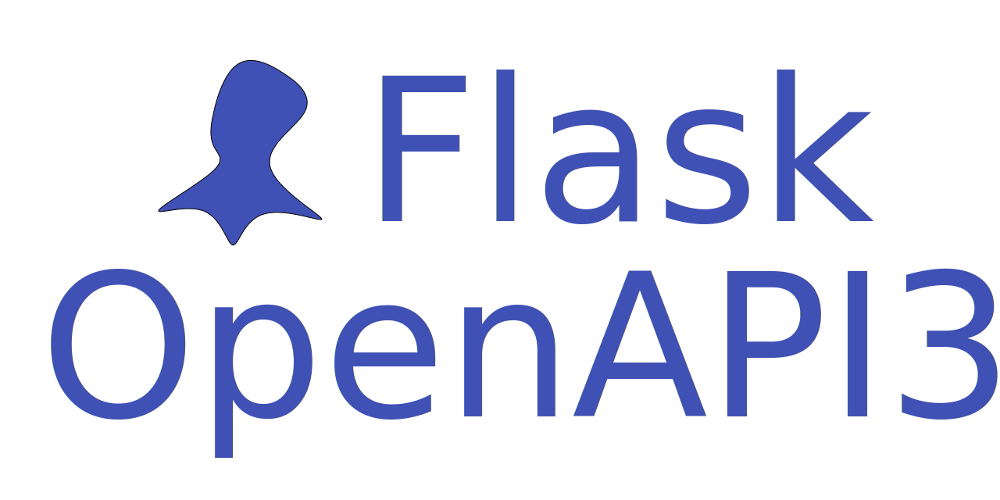

<div align="center">
    <a href="https://luolingchun.github.io/flask-openapi3/" target="_blank">
        
    </a>
</div>
<p align="center">
    <em>为你的 Flask 项目生成 REST API 和 OpenAPI 文档。</em>
</p>
<p align="center">
    <a href="https://github.com/luolingchun/flask-openapi3/actions/workflows/tests.yml" target="_blank">
        
    </a>
    <a href="https://pypi.org/project/flask-openapi3/" target="_blank">
        
    </a>
    <a href="https://pypistats.org/packages/flask-openapi3" target="_blank">
        
    </a>
    <a href="https://pypi.org/project/flask-openapi3/" target="_blank">
        
    </a>
</p>

**Flask OpenAPI3** 是一个基于 **Flask** 的 web API 框架，使用 **Pydantic** 验证数据，自动生成交互文档。

主要特点有：

- **编码简单：** 使用简单易于学习
- **标准的文档规范：** 基于[开放 API 规范](https://spec.openapis.org/oas/v3.1.0)
- **交互式 OpenAPI 文档：** [Swagger](https://github.com/swagger-api/swagger-ui), [Redoc](https://github.com/Redocly/redoc), [RapiDoc](https://github.com/rapi-doc/RapiDoc), [RapiPdf](https://mrin9.github.io/RapiPdf/), [Scalar](https://github.com/scalar/scalar), [Elements](https://github.com/stoplightio/elements)
- **数据验证：** 基于 [Pydantic](https://github.com/pydantic/pydantic) 的快速数据验证

## 依赖

Python 3.10+

flask-openapi3 依赖以下库：

- [Flask](https://github.com/pallets/flask)：用于WEB服务
- [Pydantic](https://github.com/pydantic/pydantic)：用于数据验证

## 安装

```bash
pip install -U flask-openapi3
```

或者

```bash
conda install -c conda-forge flask-openapi3
```

<details markdown="block">
<summary>可选依赖项</summary>

- [python-email-validator](https://github.com/JoshData/python-email-validator) 支持邮箱验证；
- [python-dotenv](https://github.com/theskumar/python-dotenv#readme) 在运行 `flask`
  命令时启用对[ dotenv 环境变量](https://flask.palletsprojects.com/en/latest/cli/#dotenv) 的支持；
- [pyyaml](https://github.com/yaml/pyyaml) 用于输出 `yaml`格式的 OpenAPI 文档；
- [asgiref](https://github.com/django/asgiref) 允许在定义视图函数时使用 `async def` 和 `await`；
- [flask-openapi3-plugins](https://github.com/luolingchun/flask-openapi3-plugins) 为 Flask-OpenAPI3 提供 OpenAPI UI.

和 flask-openapi3 一起安装这些依赖:

```bash
pip install flask-openapi3[yaml]
# 或者
pip install flask-openapi3[async]
# 或者
pip install flask-openapi3[dotenv]
# 或者
pip install flask-openapi3[email]
# 或者安装全部
pip install flask-openapi3[yaml,async,dotenv,email]
# 或者手动安装
pip install pyyaml asgiref python-dotenv email-validator
# OpenAPI UI 插件
pip install -U flask-openapi3[swagger,redoc,rapidoc,rapipdf,scalar,elements]
```

</details>

## 一个简单的示例

这里有一个简单的示例，更多示例请查看[示例](https://luolingchun.github.io/flask-openapi3/latest/zh/Example/)。

```python
from pydantic import BaseModel

from flask_openapi3 import Info, Tag
from flask_openapi3 import OpenAPI

info = Info(title="book API", version="1.0.0")
app = OpenAPI(__name__, info=info)

book_tag = Tag(name="book", description="Some Book")


class BookQuery(BaseModel):
    age: int
    author: str


@app.get("/book", summary="get books", tags=[book_tag])
def get_book(query: BookQuery):
    """
    to get all books
    """
    return {
        "code": 0,
        "message": "ok",
        "data": [
            {"bid": 1, "age": query.age, "author": query.author},
            {"bid": 2, "age": query.age, "author": query.author}
        ]
    }


if __name__ == "__main__":
    app.run(debug=True)
```


<details>
<summary>基于类的 API 视图示例</summary>

```python
from pydantic import BaseModel, Field

from flask_openapi3 import OpenAPI, Tag, Info, APIView


info = Info(title='book API', version='1.0.0')
app = OpenAPI(__name__, info=info)

api_view = APIView(url_prefix="/api/v1", view_tags=[Tag(name="book")])


class BookPath(BaseModel):
    id: int = Field(..., description="book ID")


class BookQuery(BaseModel):
    age: int | None = Field(None, description='Age')


class BookBody(BaseModel):
    age: int | None = Field(..., ge=2, le=4, description='Age')
    author: str = Field(None, min_length=2, max_length=4, description='Author')


@api_view.route("/book")
class BookListAPIView:
    a = 1

    @api_view.doc(summary="get book list")
    def get(self, query: BookQuery):
        print(self.a)
        return query.model_dump_json()

    @api_view.doc(summary="create book")
    def post(self, body: BookBody):
        """description for a created book"""
        return body.model_dump_json()


@api_view.route("/book/<id>")
class BookAPIView:
    @api_view.doc(summary="get book")
    def get(self, path: BookPath):
        print(path)
        return "get"

    @api_view.doc(summary="update book")
    def put(self, path: BookPath):
        print(path)
        return "put"

    @api_view.doc(summary="delete book", deprecated=True)
    def delete(self, path: BookPath):
        print(path)
        return "delete"


app.register_api_view(api_view)

if __name__ == "__main__":
    app.run(debug=True)
```
</details>

## API 文档

运行[简单示例](https://github.com/luolingchun/flask-openapi3/blob/master/examples/simple_demo.py)，然后访问 http://127.0.0.1:5000/openapi。

> OpenAPI UI插件是需要手动安装的可选依赖项。
> 
> `pip install -U flask-openapi3[swagger,redoc,rapidoc,rapipdf,scalar,elements]`
> 
> 更多可选[UI模板](https://luolingchun.github.io/flask-openapi3/latest/Usage/UI_Templates/)


